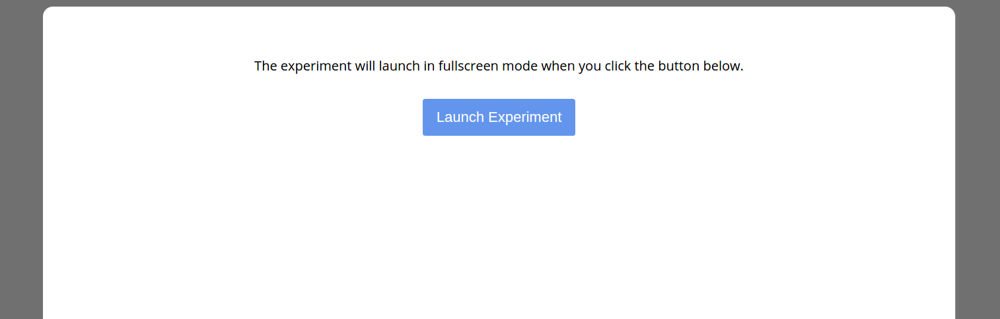

# The Experiment Factory (MySQL) Stanford Example

Looking to run an [experiment factory experiment](https://expfactory.github.io/experiments.html) from Stanford? We have full instructions for that! Complete instructions are included on the [Research Applications Portal](https://researchapps.github.io/experiments/2016/11/03/experiment-factory-stanford/). If you need help or have a feature request, please [submit an issue](https://github.com/researchapps/template-experiments-mysql/issues)

